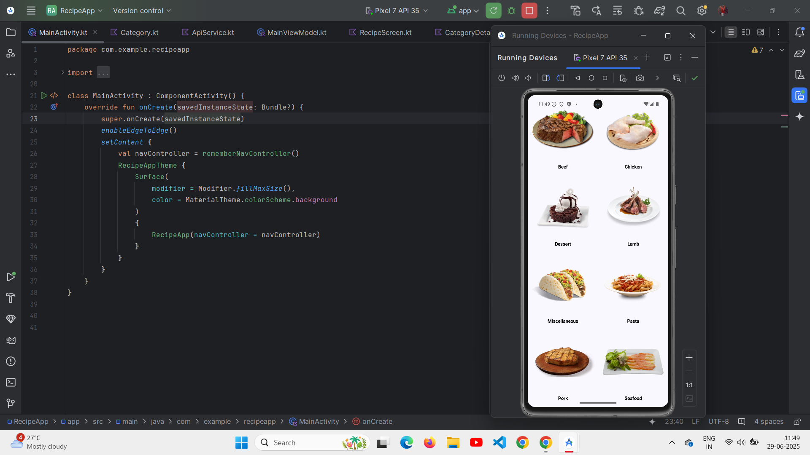
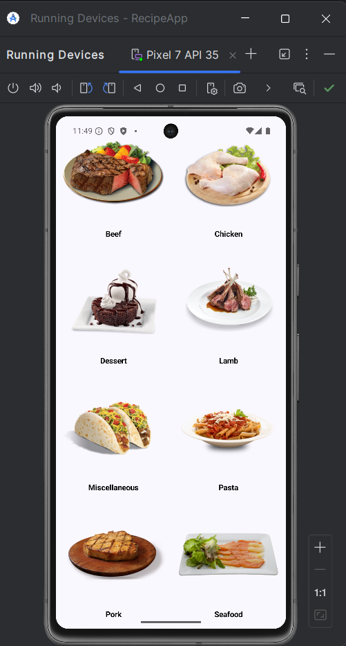
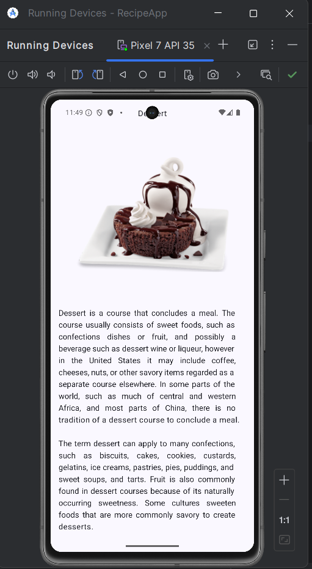

<h1 align="center">🍽️ RecipeApp</h1>

  
  
  

---

## 📱 Project Overview

**MyRecipeApp** is a modern Android application built using **Jetpack Compose** and the **MVVM architecture pattern**.  
It fetches real-time data from **TheMealDB REST API** to display a list of meal categories, and on selecting a category, it shows corresponding meals with their images dynamically via Retrofit integration.

---

## 🔧 Features

<ul>
  <li>Jetpack Compose UI framework</li>
  <li>MVVM architecture for clean separation of concerns</li>
  <li>Retrofit integration for HTTP requests and JSON parsing</li>
  <li>Lazy vertical grid to display recipe categories with images</li>
  <li>Navigation component for smooth screen transitions</li>
  <li>Detailed recipe meal listings per category</li>
  <li>Clean, responsive, and modern UI</li>
</ul>

---

## 📸 Screenshots

<!-- Landscape image full width -->

  

<!-- Portrait images side by side with spacing -->

  
  &nbsp;&nbsp;&nbsp;&nbsp;&nbsp;&nbsp;&nbsp;&nbsp;&nbsp;&nbsp;&nbsp;&nbsp;&nbsp;&nbsp;&nbsp;&nbsp;&nbsp;&nbsp;&nbsp;&nbsp;&nbsp;&nbsp;&nbsp;&nbsp;&nbsp;&nbsp;&nbsp;&nbsp;&nbsp;&nbsp;&nbsp;&nbsp;&nbsp;&nbsp;&nbsp;&nbsp;&nbsp;&nbsp;&nbsp;&nbsp;
  

---

## 📦 Tech Stack

- **Kotlin**
- **Jetpack Compose**
- **MVVM**
- **Retrofit**
- **Gson Converter**
- **TheMealDB API**
- **AndroidX Navigation Compose**

---

## 🚀 How to Run

1. Clone this repository:

2. Open it in **Android Studio**.

3. Make sure to have an active internet connection for API calls.

4. Run the app on an Android device/emulator (minimum SDK 24+).

---

## 📚 API Reference

- 📖 [TheMealDB API Documentation](https://www.themealdb.com/api.php)

---

## 📝 License

This project is open-source and available under the [MIT License](LICENSE).

---

## 🙌 Author

**Siddhant Kudale**  
[GitHub Profile](https://github.com/siddhantkudale18)

---

